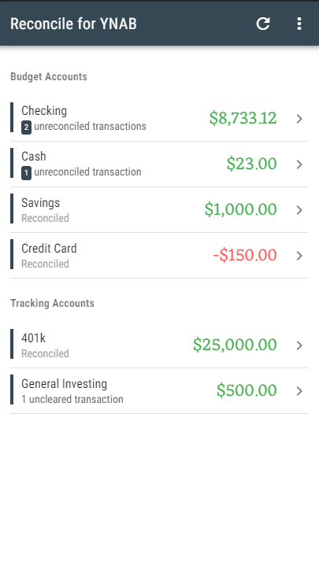
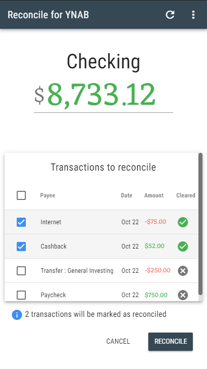

# ynab-reconcile

Faciliate account reconciliation, especially on mobile. Quickly mark YNAB transactions to reconcile and edit the final balance, and the it will create a reconciliation transaction for you.

Your data stays between your browser and YNAB, this is a fully client-side application that directly interfaces with the YNAB API to get the data and create & mark transactions for reconciliation.

## Usage

On mobile, it is convenient to create a home shortcut (`Add to home screen`) for the website, it then acts much like an app.

From the home screen, you can connect to your YNAB account and pick the budget you want to look at:


Then, you get a view of your available budget & tracking accounts, along with their reconciliation status. Here is a fictive example on a test budget: 

After clicking on an account, you may mark transactions for reconciliation, you can also select uncleared transactions if you forgot to mark them as cleared in YNAB, but they won't be selected by default: 

If, even after marking your transactions to reconcile, your balance is still off, you can edit the balance directly, and it will take care of creating a reconciliation transaction for you (much like YNAB does on desktop!). Here, we edited our _Savings_ account from `$1000` to `$1250`: 

## Project setup
```
yarn install
```

Create a `.env.local.` file with the following contents:
```
VUE_APP_YNAB_OAUTH_CLIENT_ID = '...'
```
Where `...` is your client ID, in your YNAB developer settings.

### Compiles and hot-reloads for development
```
yarn serve
```

### Compiles and minifies for production
```
yarn build
```

### Lints and fixes files
```
yarn lint
```

### Customize configuration
See [Configuration Reference](https://cli.vuejs.org/config/).
